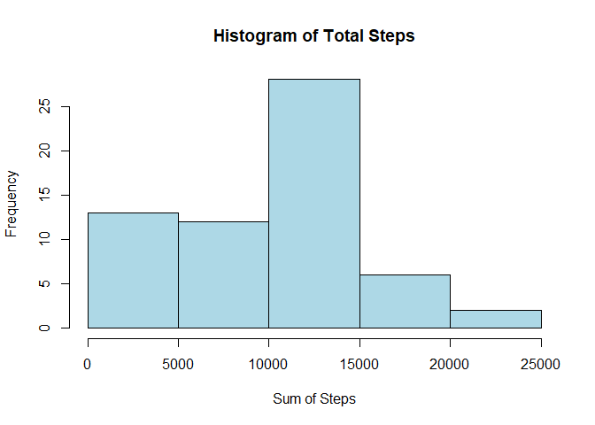
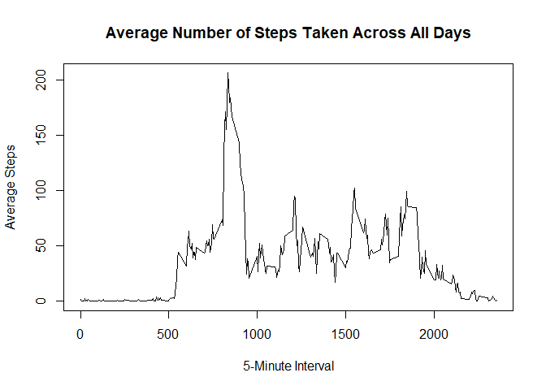
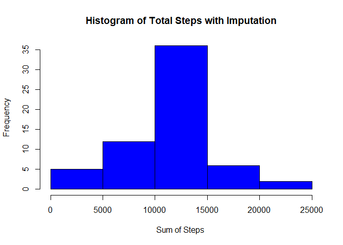
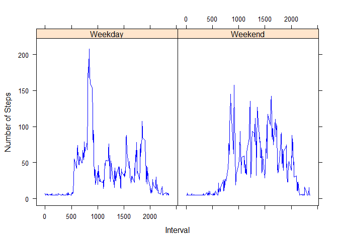

This is an R Markdown document for Week 2 in Reproducible Research using
the activity data.

### **1. Code for reading in the dataset and/or processing the data**

Steps:  
- Set working directory  
- Read in the data  
- Check columns and update format of date column  
- Print first six rows to check data

        setwd("C:/Users/Allison.Moore/Desktop/Coursera/RepData_PeerAssessment1/activity/")
        activity <- read.csv("activity.csv", header = TRUE)
        str(activity$date)

    ##  Factor w/ 61 levels "2012-10-01","2012-10-02",..: 1 1 1 1 1 1 1 1 1 1 ...

        activity$date <- as.POSIXct(strptime(activity$date, "%Y-%m-%d"))
        
        head(activity)

    ##   steps       date interval
    ## 1    NA 2012-10-01        0
    ## 2    NA 2012-10-01        5
    ## 3    NA 2012-10-01       10
    ## 4    NA 2012-10-01       15
    ## 5    NA 2012-10-01       20
    ## 6    NA 2012-10-01       25

### **2. Histogram of the total number of steps taken each day**

Calculate the sum of steps per day and graph that using a histogram

    steps_sum <- tapply(activity$steps, activity$date, FUN=sum, na.rm = TRUE)
    hist(steps_sum, main = "Histogram of Total Steps", xlab = "Sum of Steps", col = "lightblue")

### **3. Mean and median number of steps taken each day**

Look at the overall mean and median for steps

        mean(activity$steps, na.rm = TRUE)

    ## [1] 37.3826

        median(activity$steps, na.rm = TRUE)

    ## [1] 0

Calculate the mean and median by date and output

        steps_mean <- aggregate(steps ~ date, data = activity, FUN=mean, na.rm=TRUE)
        steps_median <- aggregate(steps ~ date, data = activity, FUN=median, na.rm=TRUE)
        
            steps_summary <- merge(x = steps_mean, y = steps_median, by = c("date", "date"))
            colnames(steps_summary) <- c("Date", "Mean Steps", "Median Steps")
            print(steps_summary)

    ##          Date Mean Steps Median Steps
    ## 1  2012-10-02  0.4375000            0
    ## 2  2012-10-03 39.4166667            0
    ## 3  2012-10-04 42.0694444            0
    ## 4  2012-10-05 46.1597222            0
    ## 5  2012-10-06 53.5416667            0
    ## 6  2012-10-07 38.2465278            0
    ## 7  2012-10-09 44.4826389            0
    ## 8  2012-10-10 34.3750000            0
    ## 9  2012-10-11 35.7777778            0
    ## 10 2012-10-12 60.3541667            0
    ## 11 2012-10-13 43.1458333            0
    ## 12 2012-10-14 52.4236111            0
    ## 13 2012-10-15 35.2048611            0
    ## 14 2012-10-16 52.3750000            0
    ## 15 2012-10-17 46.7083333            0
    ## 16 2012-10-18 34.9166667            0
    ## 17 2012-10-19 41.0729167            0
    ## 18 2012-10-20 36.0937500            0
    ## 19 2012-10-21 30.6284722            0
    ## 20 2012-10-22 46.7361111            0
    ## 21 2012-10-23 30.9652778            0
    ## 22 2012-10-24 29.0104167            0
    ## 23 2012-10-25  8.6527778            0
    ## 24 2012-10-26 23.5347222            0
    ## 25 2012-10-27 35.1354167            0
    ## 26 2012-10-28 39.7847222            0
    ## 27 2012-10-29 17.4236111            0
    ## 28 2012-10-30 34.0937500            0
    ## 29 2012-10-31 53.5208333            0
    ## 30 2012-11-02 36.8055556            0
    ## 31 2012-11-03 36.7048611            0
    ## 32 2012-11-05 36.2465278            0
    ## 33 2012-11-06 28.9375000            0
    ## 34 2012-11-07 44.7326389            0
    ## 35 2012-11-08 11.1770833            0
    ## 36 2012-11-11 43.7777778            0
    ## 37 2012-11-12 37.3784722            0
    ## 38 2012-11-13 25.4722222            0
    ## 39 2012-11-15  0.1423611            0
    ## 40 2012-11-16 18.8923611            0
    ## 41 2012-11-17 49.7881944            0
    ## 42 2012-11-18 52.4652778            0
    ## 43 2012-11-19 30.6979167            0
    ## 44 2012-11-20 15.5277778            0
    ## 45 2012-11-21 44.3993056            0
    ## 46 2012-11-22 70.9270833            0
    ## 47 2012-11-23 73.5902778            0
    ## 48 2012-11-24 50.2708333            0
    ## 49 2012-11-25 41.0902778            0
    ## 50 2012-11-26 38.7569444            0
    ## 51 2012-11-27 47.3819444            0
    ## 52 2012-11-28 35.3576389            0
    ## 53 2012-11-29 24.4687500            0

### **4.Time series plot of the average number of steps taken**

      avg_steps <- aggregate(steps ~ interval, data = activity, FUN=mean, na.rm = TRUE)
       with(avg_steps, plot(interval, steps, type = "l", 
                            main = "Average Number of Steps Taken Across All Days",
                            xlab = "5-Minute Interval", ylab = "Average Steps"))

### **5. The 5-minute interval that, on average, contains the maximum number of steps**

This will output the row it occurs, the interval, and the maximum steps

      avg_steps[which.max(avg_steps$steps), ]

    ##     interval    steps
    ## 104      835 206.1698

### **6. Code to describe and show a strategy for imputing missing data**

Results:  
- The overall mean did not change because we imputed with the column
mean  
- The overall median did not change either because there were only 2304
missing values and this was not enough to change the median  
- Some of the by day means and medians changed  
- The histograms changed  
- Overall: Change to graphs of data but little impact to overall summary
statistics because imputated data only accounted for 13% of data

Number of missing values in the dataset

    sum(!complete.cases(activity))

    ## [1] 2304

Fill in the missing values with the overall mean and show the new file

    activity$steps[is.na(activity$steps)] = mean(activity$steps, na.rm = TRUE)
    head(activity, 10)

    ##      steps       date interval
    ## 1  37.3826 2012-10-01        0
    ## 2  37.3826 2012-10-01        5
    ## 3  37.3826 2012-10-01       10
    ## 4  37.3826 2012-10-01       15
    ## 5  37.3826 2012-10-01       20
    ## 6  37.3826 2012-10-01       25
    ## 7  37.3826 2012-10-01       30
    ## 8  37.3826 2012-10-01       35
    ## 9  37.3826 2012-10-01       40
    ## 10 37.3826 2012-10-01       45

Using the new data - Look at the overall mean and median for steps

        mean(activity$steps, na.rm = TRUE)

    ## [1] 37.3826

        median(activity$steps, na.rm = TRUE)

    ## [1] 0

Using the new data - Calculate the mean and median by date

        steps_mean <- aggregate(steps ~ date, data = activity, FUN=mean, na.rm=TRUE)
        steps_median <- aggregate(steps ~ date, data = activity, FUN=median, na.rm=TRUE)
        
            steps_summary <- merge(x = steps_mean, y = steps_median, by = c("date", "date"))
            colnames(steps_summary) <- c("Date", "Mean Steps", "Median Steps")
            print(steps_summary)

    ##          Date Mean Steps Median Steps
    ## 1  2012-10-01 37.3825996      37.3826
    ## 2  2012-10-02  0.4375000       0.0000
    ## 3  2012-10-03 39.4166667       0.0000
    ## 4  2012-10-04 42.0694444       0.0000
    ## 5  2012-10-05 46.1597222       0.0000
    ## 6  2012-10-06 53.5416667       0.0000
    ## 7  2012-10-07 38.2465278       0.0000
    ## 8  2012-10-08 37.3825996      37.3826
    ## 9  2012-10-09 44.4826389       0.0000
    ## 10 2012-10-10 34.3750000       0.0000
    ## 11 2012-10-11 35.7777778       0.0000
    ## 12 2012-10-12 60.3541667       0.0000
    ## 13 2012-10-13 43.1458333       0.0000
    ## 14 2012-10-14 52.4236111       0.0000
    ## 15 2012-10-15 35.2048611       0.0000
    ## 16 2012-10-16 52.3750000       0.0000
    ## 17 2012-10-17 46.7083333       0.0000
    ## 18 2012-10-18 34.9166667       0.0000
    ## 19 2012-10-19 41.0729167       0.0000
    ## 20 2012-10-20 36.0937500       0.0000
    ## 21 2012-10-21 30.6284722       0.0000
    ## 22 2012-10-22 46.7361111       0.0000
    ## 23 2012-10-23 30.9652778       0.0000
    ## 24 2012-10-24 29.0104167       0.0000
    ## 25 2012-10-25  8.6527778       0.0000
    ## 26 2012-10-26 23.5347222       0.0000
    ## 27 2012-10-27 35.1354167       0.0000
    ## 28 2012-10-28 39.7847222       0.0000
    ## 29 2012-10-29 17.4236111       0.0000
    ## 30 2012-10-30 34.0937500       0.0000
    ## 31 2012-10-31 53.5208333       0.0000
    ## 32 2012-11-01 37.3825996      37.3826
    ## 33 2012-11-02 36.8055556       0.0000
    ## 34 2012-11-03 36.7048611       0.0000
    ## 35 2012-11-04 37.3825996      37.3826
    ## 36 2012-11-05 36.2465278       0.0000
    ## 37 2012-11-06 28.9375000       0.0000
    ## 38 2012-11-07 44.7326389       0.0000
    ## 39 2012-11-08 11.1770833       0.0000
    ## 40 2012-11-09 37.3825996      37.3826
    ## 41 2012-11-10 37.3825996      37.3826
    ## 42 2012-11-11 43.7777778       0.0000
    ## 43 2012-11-12 37.3784722       0.0000
    ## 44 2012-11-13 25.4722222       0.0000
    ## 45 2012-11-14 37.3825996      37.3826
    ## 46 2012-11-15  0.1423611       0.0000
    ## 47 2012-11-16 18.8923611       0.0000
    ## 48 2012-11-17 49.7881944       0.0000
    ## 49 2012-11-18 52.4652778       0.0000
    ## 50 2012-11-19 30.6979167       0.0000
    ## 51 2012-11-20 15.5277778       0.0000
    ## 52 2012-11-21 44.3993056       0.0000
    ## 53 2012-11-22 70.9270833       0.0000
    ## 54 2012-11-23 73.5902778       0.0000
    ## 55 2012-11-24 50.2708333       0.0000
    ## 56 2012-11-25 41.0902778       0.0000
    ## 57 2012-11-26 38.7569444       0.0000
    ## 58 2012-11-27 47.3819444       0.0000
    ## 59 2012-11-28 35.3576389       0.0000
    ## 60 2012-11-29 24.4687500       0.0000
    ## 61 2012-11-30 37.3825996      37.3826

### **7. Histogram of the total number of steps taken each day after missing values are imputed**

Using the new data - Calculate the sum of steps per day and graph that
using a histogram. This should be different from the previous histogram.

    steps_sum <- tapply(activity$steps, activity$date, FUN=sum, na.rm = TRUE)
    hist(steps_sum, main = "Histogram of Total Steps with Imputation", xlab = "Sum of Steps ", col= "blue")

### **8. Panel plot comparing the average number of steps taken per 5-minute interval across weekdays and weekends**

Steps:  
- Create a new factor for weekday or weekend  
- Make a panel plot

    activity$daytype <- ifelse(weekdays(activity$date) %in% c("Saturday", "Sunday"), "Weekend", "Weekday")
    head(activity)

    ##     steps       date interval daytype
    ## 1 37.3826 2012-10-01        0 Weekday
    ## 2 37.3826 2012-10-01        5 Weekday
    ## 3 37.3826 2012-10-01       10 Weekday
    ## 4 37.3826 2012-10-01       15 Weekday
    ## 5 37.3826 2012-10-01       20 Weekday
    ## 6 37.3826 2012-10-01       25 Weekday

      avg_steps2 <- aggregate(steps ~ interval + daytype, data = activity, FUN=mean, na.rm = TRUE)

    library(lattice)

    ## Warning: package 'lattice' was built under R version 3.4.4

    xyplot(avg_steps2$steps ~ avg_steps2$interval | avg_steps2$daytype, type = "l",
          xlab = "Interval", ylab = "Number of Steps", col = "blue")

